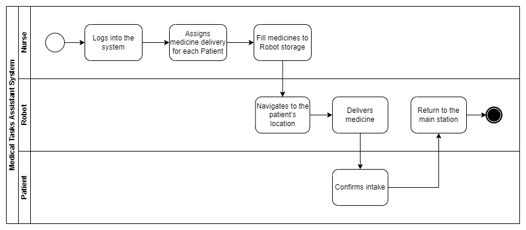

# Medical Task Assistant Robot
---

## Project Purpose

The **Autonomous Medication Distribution Robot** focuses on the following key objectives:

### 1. Medication Distribution
- A pill-dispensing system allows the robot to deliver the correct dosage to patients as per instructions.
- The robot will autonomously navigate hospital environments to reach designated rooms.

### 2. Patient Health Monitoring
- Integrated health-monitoring sensors measure patient metrics such as:
  - Oxygen levels
  - Blood pressure
  - Body temperature
- These metrics can be used for real-time monitoring and future AI-driven personalization.

- ### 3. Reliable Communication & Control
- Communication between the robot and the system relies on:
  - Wi-Fi for real-time updates
  - SSH for remote access
  - Wired connections for initial setups and data transfer
- Ensures smooth operation and high reliability in hospital settings.

### 4. Future Enhancements
- AI-driven pill scheduling and distribution based on patient health data for personalized care plans.

### 5. Diagrams
- BPM Diagram:
